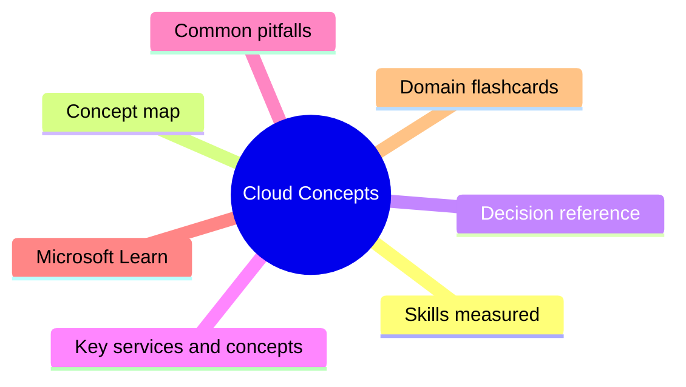
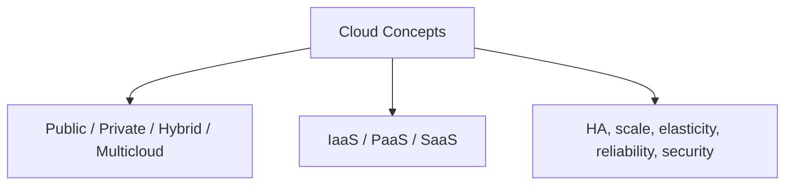

# Cloud Concepts

**Domain weight on the exam:** ~28% (for AZ-900).

## Domain mind map

## Skills measured

- Describe cloud computing: shared responsibility model, cloud models (public/private/hybrid/multicloud), consumption-based pricing.
- Benefits of cloud services: high availability, scalability, elasticity, reliability, predictability, security, governance, manageability.
- Cloud service types: IaaS (Infrastructure as a Service), PaaS (Platform as a Service), SaaS (Software as a Service); when to use each.

## Concept map

## Decision reference

| Use this | When |
| --- | --- |
| **IaaS** | Need OS-level control, lift-and-shift VMs, custom networking |
| **PaaS** | Want managed runtime / database / app platform; focus on code |
| **SaaS** | Just consume an app (M365, Dynamics, Power BI) |
| **Public cloud** | Pay-per-use, fastest to provision, shared infra |
| **Private cloud** | Dedicated hardware, full control, compliance/sovereignty |
| **Hybrid** | Connect on-prem + cloud, gradual migration, data residency |
| **Multicloud** | Avoid vendor lock-in, best-of-breed services |

## Key services and concepts

| Name | Role |
| --- | --- |
| **Shared Responsibility Model** | Defines who secures what: physical (always Microsoft) vs OS/data (varies by service model) |
| **Capital Expense (CapEx)** | Upfront hardware purchase - traditional datacenter |
| **Operational Expense (OpEx)** | Pay-as-you-go subscription - cloud |
| **Consumption-based pricing** | Pay only for resources used; scale up/down |
| **Elasticity** | Auto-scale up and DOWN based on demand |
| **Scalability** | Add capacity (vertical or horizontal) |
| **High Availability** | Service stays up despite failures (SLA) |
| **Disaster Recovery** | Restore service after region/site failure |

## Common pitfalls

- Confusing scalability (add capacity) with elasticity (also remove capacity).
- Thinking hybrid = multicloud. Hybrid = mix of cloud + on-prem. Multicloud = multiple cloud providers.
- Assuming Microsoft secures customer data in IaaS - YOU secure OS, apps, data; Microsoft secures host/network/physical.
- Mixing up CapEx (buy hardware) and OpEx (rent/subscribe).

## Microsoft Learn

- [Describe cloud computing](https://learn.microsoft.com/training/modules/describe-cloud-compute/)
- [Benefits of using cloud services](https://learn.microsoft.com/training/modules/describe-benefits-use-cloud-services/)
- [Describe cloud service types](https://learn.microsoft.com/training/modules/describe-cloud-service-types/)

## Domain flashcards

<section class="fc-section" data-fc-title="Cloud Concepts quick-fire">

Q: Define the shared responsibility model.

A: Splits security duties between customer + cloud provider. Customer always owns data and access; provider always owns physical. Middle layers depend on IaaS/PaaS/SaaS.

Q: Which cloud model has no on-prem at all?

A: Public cloud.

Q: Scalability vs elasticity?

A: Scalability = add capacity. Elasticity = add AND remove capacity automatically based on demand.

Q: CapEx vs OpEx?

A: CapEx = upfront hardware (datacenter). OpEx = subscription/pay-as-you-go (cloud).

Q: When pick PaaS over IaaS?

A: When you want managed runtime, do not want to patch OS, and focus on code instead of infrastructure.

Q: Example of SaaS from Microsoft?

A: Microsoft 365, Dynamics 365, Power BI service.

</section>
