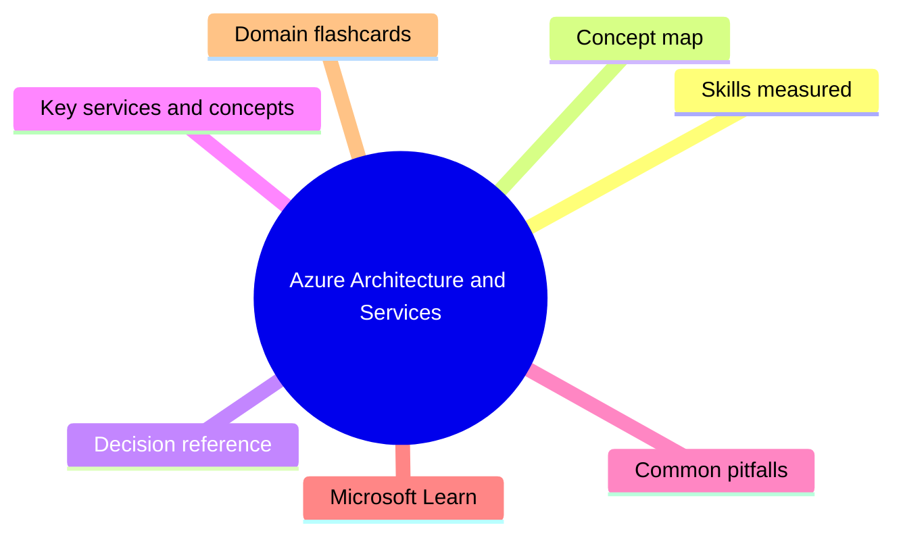
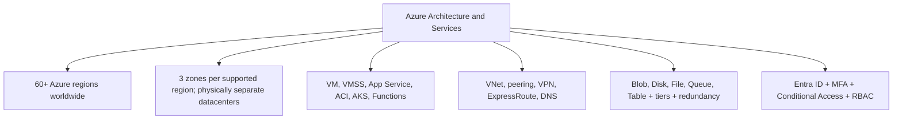

# Azure Architecture and Services

**Domain weight on the exam:** ~37% (for AZ-900).

## Domain mind map

## Skills measured

- Core architectural components: regions, region pairs, sovereign regions, availability zones, datacenters, resources, resource groups, subscriptions, management groups, hierarchy.
- Compute and networking: VMs, virtual machine scale sets, App Service, Azure Container Instances, AKS, Azure Functions, Virtual Network, VNet peering, VPN Gateway, ExpressRoute, DNS.
- Storage services: blob, disk, file, queue, table; redundancy options (LRS, ZRS, GRS, RA-GRS, GZRS), storage tiers (hot/cool/cold/archive), Azure Storage Explorer, AzCopy, Azure Migrate, Data Box.
- Identity, access, security: Microsoft Entra ID, Entra Domain Services, authentication, SSO, MFA, Conditional Access, RBAC, Zero Trust, defense in depth, Defender for Cloud.

## Concept map

## Decision reference

| Use this | When |
| --- | --- |
| **Azure VM** | Full OS control, lift-and-shift, legacy apps |
| **App Service** | Web apps/APIs without managing OS |
| **Azure Functions** | Event-driven, serverless, short-lived workloads |
| **AKS** | Container orchestration at scale |
| **ACI** | Single container, quick start, no orchestration |
| **Blob storage** | Unstructured data, images, video, backups |
| **Azure Files** | SMB/NFS file share, lift-and-shift file servers |
| **LRS** | Cheapest, 3 copies in 1 datacenter |
| **ZRS** | 3 zones in 1 region - HA across AZs |
| **GRS** | Asynchronous replication to paired region |
| **VPN Gateway** | Internet-based site-to-site/point-to-site |
| **ExpressRoute** | Private, high-bandwidth, predictable latency |

## Key services and concepts

| Name | Role |
| --- | --- |
| **Region** | Set of datacenters in a geography (e.g. East US) |
| **Region Pair** | Two regions paired for GRS replication and sequential patching |
| **Availability Zone** | Physically separate datacenter within a region (3 per AZ-enabled region) |
| **Management Group** | Org-wide container for subscriptions; for policy + RBAC |
| **Subscription** | Billing + access boundary; contains resource groups |
| **Resource Group** | Logical container for resources (same lifecycle) |
| **Azure VM** | IaaS Windows/Linux virtual machine |
| **Virtual Machine Scale Set** | Identical VMs that autoscale together |
| **Azure App Service** | PaaS web app/API/mobile backend hosting |
| **Azure Functions** | Serverless code, event-triggered, consumption pricing |
| **Azure Container Instances** | Single container as a service |
| **Azure Kubernetes Service** | Managed Kubernetes for container orchestration |
| **Virtual Network (VNet)** | Private network space in Azure |
| **VNet Peering** | Connect VNets within or across regions |
| **VPN Gateway** | Encrypted internet VPN to on-prem or other VNets |
| **ExpressRoute** | Private fiber connection, bypasses internet |
| **Azure DNS** | Host DNS zones in Azure |
| **Blob Storage** | Object store for unstructured data; hot/cool/cold/archive tiers |
| **Azure Disks** | Managed disks for VMs |
| **Azure Files** | Managed SMB/NFS file shares |
| **Microsoft Entra ID** | Cloud identity and access management (formerly Azure AD) |
| **Conditional Access** | Policy-based access controls (if-then signals) |
| **MFA** | Second factor authentication |
| **Azure RBAC** | Role-based access control on Azure resources |
| **Microsoft Defender for Cloud** | Posture management + workload protection |

## Common pitfalls

- Confusing Region Pair (GRS partner) with Availability Zone (separate DC in same region).
- Thinking RGs are a security boundary - they're a lifecycle/management boundary; security comes from RBAC + policy.
- Mixing GRS (read access in paired region only after failover) vs RA-GRS (read access anytime).
- Using VPN Gateway for high-throughput - use ExpressRoute for that.
- Forgetting AZ-enabled regions are not all regions (always check region capabilities).

## Microsoft Learn

- [Core architectural components of Azure](https://learn.microsoft.com/training/modules/describe-core-architectural-components-of-azure/)
- [Azure compute and networking services](https://learn.microsoft.com/training/modules/describe-azure-compute-networking-services/)
- [Azure storage services](https://learn.microsoft.com/training/modules/describe-azure-storage-services/)
- [Azure identity, access, and security](https://learn.microsoft.com/training/modules/describe-azure-identity-access-security/)

## Domain flashcards

<section class="fc-section" data-fc-title="Azure Architecture and Services quick-fire">

Q: What is the Azure resource hierarchy?

A: Management Group -> Subscription -> Resource Group -> Resource.

Q: What does an Availability Zone protect against?

A: Datacenter-level failure within a region. 3 zones per AZ-enabled region.

Q: What's the cheapest storage redundancy?

A: LRS (Locally Redundant Storage) - 3 copies, 1 datacenter.

Q: When use ExpressRoute over VPN Gateway?

A: When you need private connection, high bandwidth, predictable latency, no internet.

Q: What is Conditional Access?

A: Entra policy that allows/blocks/MFA-prompts based on user/device/location/risk signals.

Q: Which serverless compute pays only per execution?

A: Azure Functions in Consumption plan.

Q: Which storage tier for rarely accessed data with longer retrieval?

A: Cool (30+ day) or Cold (90+ day); Archive for >180 day and OK with hours of retrieval latency.

Q: What is Microsoft Entra ID (formerly)?

A: Azure Active Directory; cloud identity and access management service.

</section>
