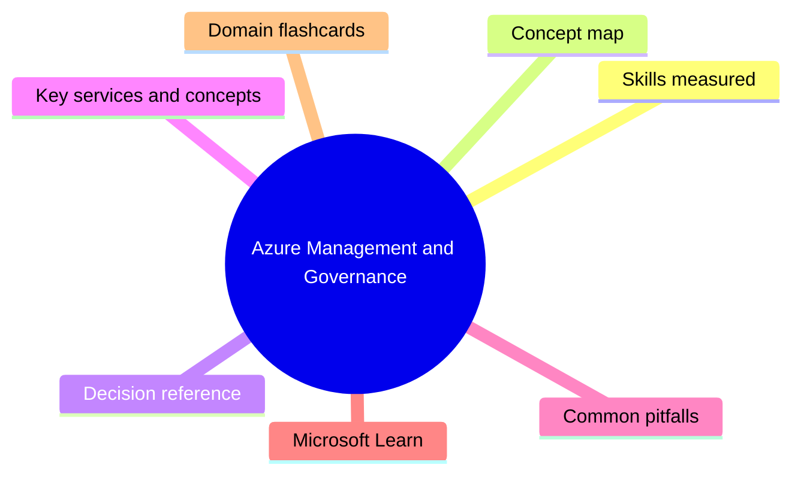
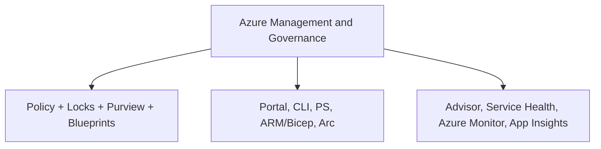

# Azure Management and Governance

**Domain weight on the exam:** ~35% (for AZ-900).

## Domain mind map

## Skills measured

- Cost management: factors (resource type, consumption, maintenance, geography, network traffic, subscription type), Pricing Calculator, TCO Calculator, Cost Management + Billing, tags.
- Governance and compliance: Microsoft Purview, Azure Policy, resource locks, Service Trust Portal.
- Manage and deploy Azure: Portal, Cloud Shell (Bash+PowerShell), CLI, PowerShell, Azure mobile app, ARM/Bicep templates, Azure Arc.
- Monitoring tools: Azure Advisor, Service Health, Azure Monitor, Log Analytics, alerts, Application Insights.

## Concept map

## Decision reference

| Use this | When |
| --- | --- |
| **Azure Pricing Calculator** | Estimate cost of resources BEFORE you provision |
| **TCO Calculator** | Compare cloud cost vs on-prem (3-year total cost) |
| **Cost Management + Billing** | View ACTUAL spending, set budgets and alerts |
| **Azure Policy** | Enforce rules (allowed locations, required tags, allowed SKUs) |
| **Resource Lock** | Prevent accidental delete (CanNotDelete) or change (ReadOnly) |
| **Microsoft Purview** | Data governance + compliance + classification |
| **Azure Monitor** | Metrics + logs + alerts + workbooks for everything |
| **Azure Advisor** | Best-practice recommendations (cost, security, performance, reliability, operational excellence) |
| **Azure Service Health** | Status of Azure services + your resource health |
| **Azure Arc** | Manage on-prem / multicloud resources from Azure |

## Key services and concepts

| Name | Role |
| --- | --- |
| **Pricing Calculator** | Pre-purchase estimate |
| **TCO Calculator** | Cloud vs on-prem ROI comparison |
| **Azure Cost Management** | Actual costs, budgets, alerts, forecasts |
| **Tags** | Key/value metadata on resources for cost/ownership/grouping |
| **Azure Policy** | Define + enforce rules at scope (MG/sub/RG) |
| **Resource Locks** | CanNotDelete or ReadOnly to protect critical resources |
| **Microsoft Purview** | Unified governance + data catalog |
| **Service Trust Portal** | Compliance reports, audit results, ISO/SOC etc. |
| **Azure Portal** | Browser-based UI |
| **Azure Cloud Shell** | Bash or PowerShell in browser |
| **Azure CLI** | Cross-platform command-line |
| **Azure PowerShell** | PowerShell module |
| **ARM Templates** | JSON IaC (legacy) |
| **Bicep** | Modern DSL for ARM (preferred) |
| **Azure Arc** | Bring on-prem/AWS/GCP servers, K8s, data services under Azure control plane |
| **Azure Monitor** | Unified observability |
| **Azure Advisor** | Recommendations engine |
| **Azure Service Health** | Service issues + planned maintenance + health advisories |
| **Application Insights** | APM for web apps + APIs |

## Common pitfalls

- Confusing Pricing Calculator (pre-buy estimate) with Cost Management (actual usage).
- Forgetting CanNotDelete lock still allows changes; ReadOnly blocks changes too.
- Thinking Policy and RBAC do the same thing - RBAC = WHO can do, Policy = WHAT can be done.
- Assuming TCO Calculator is for current costs - it's for ROI vs on-prem only.
- Not enabling Service Health alerts - you'll miss outages affecting you.

## Microsoft Learn

- [Cost management in Azure](https://learn.microsoft.com/training/modules/describe-cost-management-azure/)
- [Features and tools for governance and compliance](https://learn.microsoft.com/training/modules/describe-features-tools-azure-for-governance-compliance/)
- [Features and tools to manage and deploy Azure](https://learn.microsoft.com/training/modules/describe-features-tools-manage-deploy-azure-resources/)
- [Monitoring tools in Azure](https://learn.microsoft.com/training/modules/describe-monitoring-tools-azure/)

## Domain flashcards

<section class="fc-section" data-fc-title="Azure Management and Governance quick-fire">

Q: Difference between Pricing Calculator and TCO Calculator?

A: Pricing Calc = estimate cost of resources you plan to buy. TCO = compare full 3-yr cloud cost vs on-prem datacenter.

Q: What does Azure Policy do?

A: Enforces rules (e.g., allowed regions, required tags, allowed SKUs) at MG/sub/RG scope.

Q: Difference between Policy and RBAC?

A: RBAC = who can do actions on resources. Policy = what configurations resources can have.

Q: Two types of resource locks?

A: CanNotDelete (allow change, block delete) and ReadOnly (block change AND delete).

Q: Where to find SOC/ISO compliance reports?

A: Service Trust Portal.

Q: What gives best-practice recommendations across cost/security/reliability/performance/ops?

A: Azure Advisor.

Q: Bring on-prem servers under Azure control plane?

A: Azure Arc.

Q: Where to set a budget alert?

A: Azure Cost Management + Billing.

</section>
