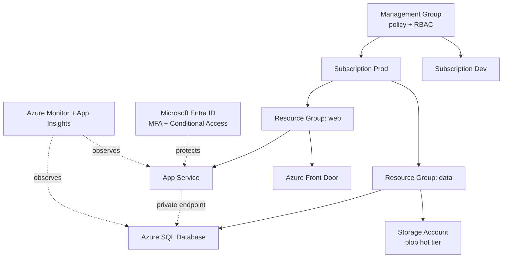

# Reference architectures (AZ-900)

A canonical wire-up of the major services.

```mermaid
flowchart TD
  MG[Management Group<br/>policy + RBAC] --> Sub1[Subscription Prod]
  MG --> Sub2[Subscription Dev]
  Sub1 --> RG1[Resource Group: web]
  Sub1 --> RG2[Resource Group: data]
  RG1 --> APP[App Service]
  RG1 --> CDN[Azure Front Door]
  RG2 --> SQL[Azure SQL Database]
  RG2 --> BLOB[Storage Account<br/>blob hot tier]
  APP -.private endpoint.-> SQL
  Identity[Microsoft Entra ID<br/>MFA + Conditional Access] -.protects.-> APP
  Monitor[Azure Monitor + App Insights] -.observes.-> APP
  Monitor -.observes.-> SQL
```
